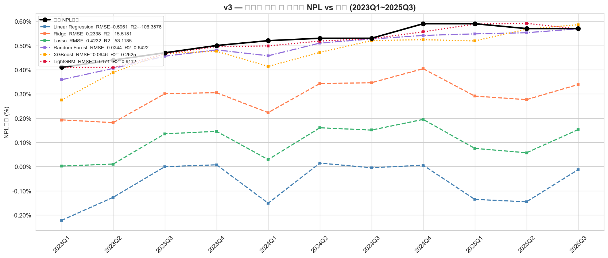
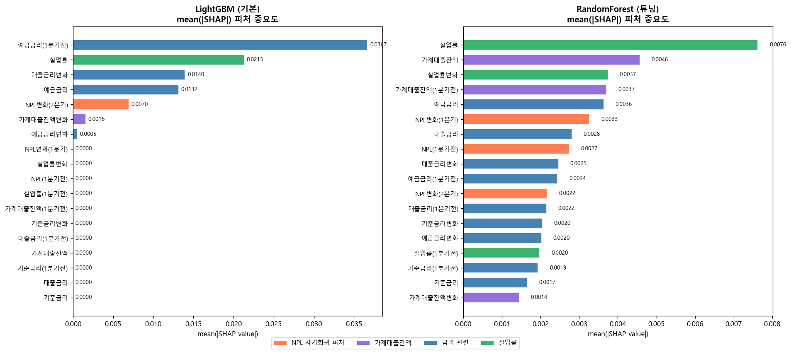
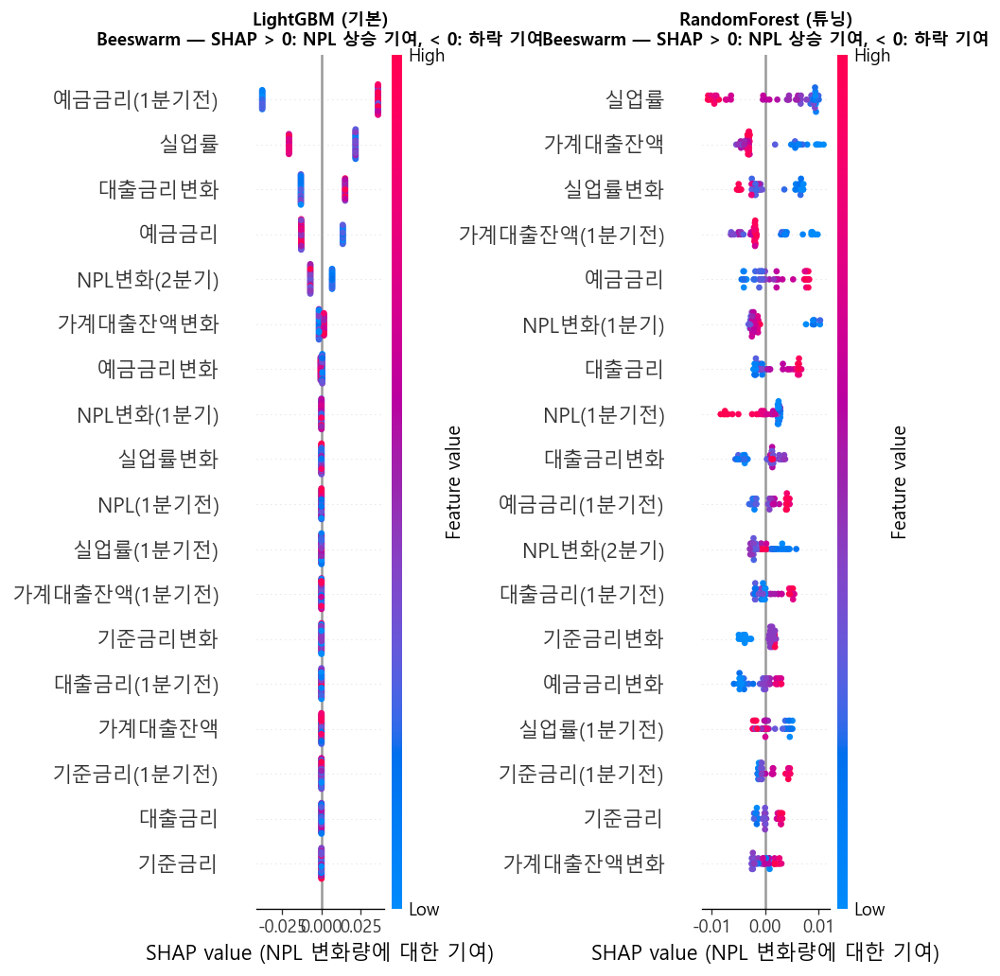
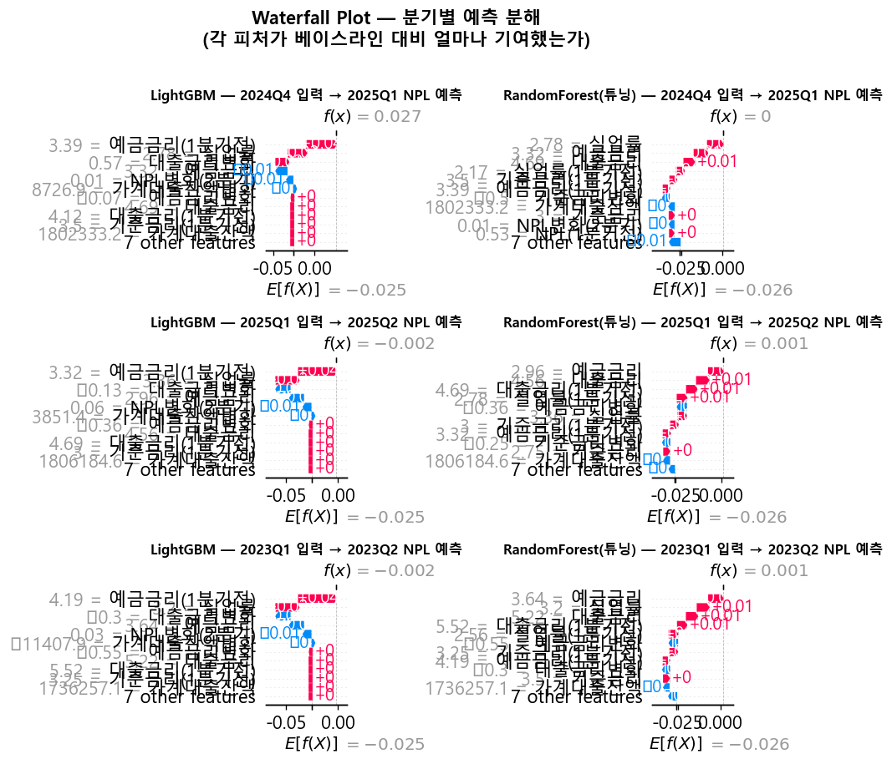

# 거시경제 지표로 다음 분기 은행 연체율(NPL)을 예측할 수 있을까?

[](https://www.python.org/)
[](https://lightgbm.readthedocs.io/)
[](https://shap.readthedocs.io/)

---

## 프로젝트 개요

국내은행의 **NPL비율(고정이하여신비율)** 을 금리·실업률·가계대출 등 거시경제 지표만으로 예측하는 ML 모델을 구축했습니다.

단순히 "예측이 가능한가"를 넘어, **왜 그 예측이 나왔는지**를 SHAP으로 해석하는 것까지 목표로 했습니다.

| 항목 | 내용 |
|------|------|
| 데이터 기간 | 2011Q4 ~ 2025Q4 (57개 분기) |
| 예측 대상 | 다음 분기 NPL비율 (%) |
| 최고 모델 | LightGBM (기본 파라미터) |
| 최고 성능 | **RMSE 0.017%, R² 0.91, MAPE 2.37%** |

---

## 핵심 결과

### 예측 vs 실제 (테스트 기간: 2023Q1 ~ 2025Q3)



> 11개 분기 연속 상승/하락 **방향 예측 100% 정확**, 평균 절대 오차 **0.012%p**

---

## 분석 흐름

```
데이터 수집 → EDA → 모델링 v1/v2/v3 → 하이퍼파라미터 튜닝 → SHAP 해석
```

### 핵심 인사이트 3가지

**① NPL 절대값보다 변화량을 예측하는 게 더 효과적**
- v1(절대값 예측): R² = -0.75 (실패)
- v3(변화량 예측 후 복원): R² = 0.91 (성공)
- 훈련 기간의 하락 추세 ↔ 테스트 기간의 반등 추세, 이 패턴 전환 문제를 변화량 예측이 해결

**② 금리는 1분기 시차를 두고 NPL에 영향**
- SHAP 분석 결과 `기준금리(현재값)`보다 `기준금리(1분기전)`이 2배 이상 중요
- EDA의 Lag 상관분석 결과와 일치

**③ 실업률이 예상보다 훨씬 중요**
- 단순 상관계수(r=0.29)에서는 약해 보였으나 SHAP 기준 2위 피처
- 다른 거시지표와의 비선형 상호작용을 통해 NPL 변화에 기여

---

## 모델 버전별 비교

| 버전 | 예측 방식 | 최고 RMSE | R² |
|------|----------|----------|-----|
| v1 | 거시지표만으로 NPL 절대값 예측 | 0.076% | -0.75 |
| v2 | v1 + 이전 분기 NPL 추가 | 0.084% | -1.13 |
| **v3** | **거시지표 + 이전 NPL로 변화량 예측** | **0.017%** | **0.91** |
| 튜닝 | v3 구조에서 TimeSeriesSplit CV 튜닝 | LGB: 0.046% / RF: 0.022% | - |

> LightGBM 기본 파라미터가 튜닝보다 오히려 우수 — 훈련 데이터(45개)가 적어 CV 최적값이 과적합

---

## SHAP — 피처 영향력 분석

### 피처 중요도 (mean |SHAP|)



### Beeswarm — 방향과 크기 분포



### Waterfall — 분기별 예측 분해



---

## 피처 엔지니어링

| 피처 유형 | 내용 | 개수 |
|----------|------|------|
| 거시지표 현재값 | 기준금리, 예금금리, 대출금리, 실업률, 가계대출잔액 | 5개 |
| 거시지표 Lag1 | 1분기 전 값 | 5개 |
| 거시지표 Diff1 | 전 분기 대비 변화량 | 5개 |
| NPL 자기회귀 | 이전 NPL, NPL 1/2분기 변화량 | 3개 |
| **합계** | | **18개** |

---

## 프로젝트 구조

```
bank_delinquency_prediction/
├── data/
│   ├── raw/                    # 원본 데이터 (금융감독원, 한국은행)
│   │   ├── macro_indicators.csv
│   │   └── bank_kpi.csv
│   └── processed/
│       ├── dataset.csv         # 최종 분석 데이터 (57개 분기)
│       └── fig_*.png           # 시각화 결과물
├── notebooks/
│   ├── 01_data_collection.ipynb   # 데이터 수집
│   ├── 02_eda.ipynb               # 탐색적 데이터 분석
│   ├── 03_modeling.ipynb          # ML 모델링 v1
│   ├── 04_modeling_v2.ipynb       # ML 모델링 v2 (NPL lag 추가)
│   ├── 05_modeling_v3.ipynb       # ML 모델링 v3 (변화량 예측) ★
│   ├── 06_hyperparameter_tuning.ipynb  # 하이퍼파라미터 튜닝
│   └── 07_shap.ipynb              # SHAP 피처 영향력 분석
├── requirements.txt
└── README.md
```

---

## 사용 기술

| 범주 | 기술 |
|------|------|
| 언어 | Python 3.11 |
| 데이터 | pandas, numpy |
| 시각화 | matplotlib, seaborn |
| ML 모델 | scikit-learn, XGBoost, LightGBM |
| 해석 | SHAP |
| 튜닝 | RandomizedSearchCV + TimeSeriesSplit |

---

## 데이터 출처

- **기준금리, 예금금리, 대출금리**: 한국은행 경제통계시스템(ECOS)
- **실업률**: 통계청
- **가계대출잔액**: 한국은행
- **NPL비율(고정이하여신비율), BIS비율, ROA, NIM**: 금융감독원

---

## 한계 및 향후 개선 방향

| 한계 | 개선 방향 |
|------|----------|
| 57개 분기로 학습 데이터 절대량 부족 | 월별 데이터로 전환 시 3배 이상 확보 가능 |
| 거시지표 외 산업별 리스크 미반영 | PF대출 비중, 부동산 지수 등 추가 |
| 단일 1분기 ahead 예측 | 2~4분기 ahead 다중 예측으로 확장 |

---

## 실행 방법

```bash
# 의존성 설치
pip install -r requirements.txt

# 노트북 순서대로 실행
jupyter notebook notebooks/02_eda.ipynb
jupyter notebook notebooks/05_modeling_v3.ipynb  # 핵심 모델
jupyter notebook notebooks/07_shap.ipynb          # SHAP 해석
```
